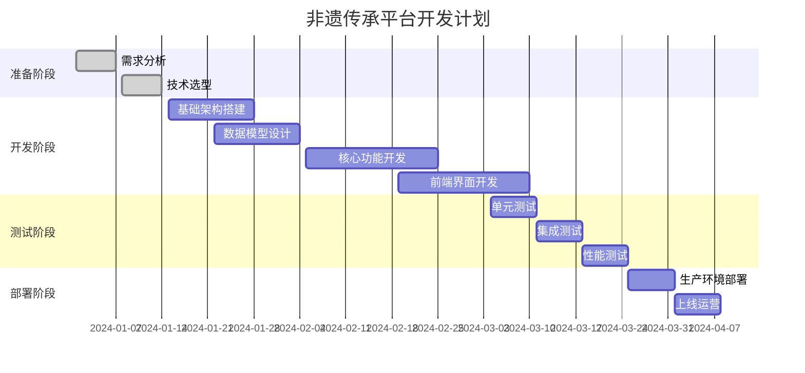

# 非遗传承平台需求文档

## 1. 项目概述

### 1.1 项目背景
非物质文化遗产是人类文明的重要组成部分，承载着丰富的历史文化内涵。随着数字化时代的到来，传统的非遗保护和传承方式面临新的挑战和机遇。本项目旨在构建一个基于Spring Boot的非遗传承平台，通过数字化手段促进非遗文化的保护、传承和创新发展。

### 1.2 项目目标
- 建立完善的非遗资源数字化管理体系
- 提供多样化的非遗展示和体验方式
- 促进非遗文化的传播和教育
- 支持非遗传承人与公众的互动交流
- 推动非遗文化的创新发展和产业化

### 1.3 目标用户
- **普通用户**：对非遗文化感兴趣的公众
- **非遗传承人**：各级非遗项目的传承人
- **教育工作者**：从事文化教育的教师和研究人员
- **文化机构**：博物馆、文化馆等文化传播机构
- **管理员**：平台运营和内容管理人员

## 2. 功能模块概述

### 2.1 用户管理模块
- 用户注册与登录
- 用户信息管理
- 权限控制
- 兴趣标签管理

### 2.2 非遗传承资源展示模块
- 非遗资源浏览与搜索
- 多媒体内容展示
- 分类导航
- 详情页面展示
- 互动功能

### 2.3 传承人管理模块
- 传承人信息管理
- 传承人认证
- 作品发布管理

### 2.4 教育学习模块
- 在线课程
- 学习路径
- 知识测试
- 学习记录

### 2.5 社区互动模块
- 用户关注
- 评论互动
- 分享功能
- 活动参与

### 2.6 内容管理模块
- 内容审核
- 分类管理
- 标签管理
- 数据统计

## 3. 非遗传承资源展示模块详细需求

### 3.1 模块概述
非遗传承资源展示模块是平台的核心功能模块，负责展示各类非遗文化资源，为用户提供丰富的非遗文化体验。该模块支持多种媒体形式的内容展示，包括图文、音频、视频等，并提供智能化的搜索和推荐功能。

### 3.2 功能需求

#### 3.2.1 资源浏览功能

**功能描述**：用户可以浏览平台上的所有非遗资源，支持多种浏览方式。

**具体需求**：
- **列表浏览**：以列表形式展示非遗资源，支持分页加载
- **网格浏览**：以卡片网格形式展示，适合图片类资源
- **时间线浏览**：按时间顺序展示资源的发展历程
- **地图浏览**：基于地理位置展示不同地区的非遗资源
- **分类浏览**：按非遗类别（如传统技艺、民俗、戏曲等）进行分类展示

**技术实现**：
- 使用分页查询优化大数据量加载
- 实现懒加载和虚拟滚动提升性能
- 集成地图API实现地理位置展示
- 支持响应式设计，适配不同设备

#### 3.2.2 智能搜索功能

**功能描述**：提供强大的搜索功能，帮助用户快速找到感兴趣的非遗资源。

**具体需求**：
- **关键词搜索**：支持标题、描述、标签等多字段搜索
- **高级搜索**：支持按类型、地区、时间等条件筛选
- **智能推荐**：基于用户兴趣和行为推荐相关资源
- **搜索历史**：记录用户搜索历史，支持快速重复搜索
- **热门搜索**：展示平台热门搜索关键词
- **搜索建议**：输入时提供自动补全和搜索建议

**技术实现**：
- 集成Elasticsearch实现全文搜索
- 使用机器学习算法实现个性化推荐
- 实现搜索结果高亮显示
- 支持模糊搜索和同义词搜索

#### 3.2.3 多媒体内容展示

**功能描述**：支持多种媒体格式的非遗资源展示，提供丰富的视觉和听觉体验。

**具体需求**：

**静态资源展示**：
- **高清图片展示**：支持图片缩放、旋转、全屏查看
- **图片轮播**：多张图片的轮播展示
- **图片标注**：支持在图片上添加说明标注
- **文字内容**：支持富文本格式，包括标题、段落、列表等
- **PDF文档**：支持在线PDF文档查看

**动态资源展示**：
- **视频播放**：支持多种视频格式，提供播放控制功能
- **音频播放**：支持音频文件播放，提供播放列表功能
- **直播功能**：支持非遗传承人进行直播教学
- **360度全景**：支持全景图片和视频展示
- **AR/VR体验**：集成增强现实和虚拟现实技术

**技术实现**：
- 使用CDN加速多媒体内容加载
- 实现自适应码率视频播放
- 集成WebRTC实现直播功能
- 使用Three.js实现3D和全景展示
- 集成AR.js和A-Frame实现AR/VR功能

#### 3.2.4 详情页面展示

**功能描述**：为每个非遗资源提供详细的信息展示页面。

**具体需求**：

**基本信息展示**：
- **资源标题**：清晰显示资源名称
- **资源描述**：详细的文字描述，支持富文本格式
- **分类标签**：显示资源所属的分类和标签
- **创建时间**：资源的创建和更新时间
- **作者信息**：传承人或创作者信息
- **地理位置**：资源的地理来源信息

**扩展信息展示**：
- **历史背景**：非遗项目的历史渊源和发展历程
- **文化内涵**：深入解读文化意义和价值
- **制作工艺**：详细的制作过程和技艺要点
- **传承谱系**：传承人的师承关系和传承脉络
- **相关资料**：相关的文献、图片、视频等资料

**互动功能**：
- **点赞收藏**：用户可以点赞和收藏感兴趣的资源
- **评论互动**：用户可以发表评论和回复
- **分享功能**：支持分享到社交媒体平台
- **学习笔记**：用户可以添加个人学习笔记
- **相关推荐**：推荐相关的非遗资源

**技术实现**：
- 使用响应式布局适配不同设备
- 实现图片懒加载优化页面性能
- 集成社交媒体分享API
- 使用缓存机制提升页面加载速度

#### 3.2.5 分类导航功能

**功能描述**：提供清晰的分类导航，帮助用户按类别浏览非遗资源。

**具体需求**：

**分类体系**：
- **一级分类**：传统技艺、民俗、戏曲、音乐、舞蹈等
- **二级分类**：在一级分类下进一步细分
- **地域分类**：按省份、城市、区县进行地域分类
- **时代分类**：按历史时期进行分类
- **传承级别**：按国家级、省级、市级等级别分类

**导航界面**：
- **树形导航**：层级清晰的树形结构导航
- **标签云**：以标签云形式展示热门分类
- **面包屑导航**：显示当前浏览位置的路径
- **快速筛选**：提供快速筛选条件
- **分类统计**：显示每个分类下的资源数量

**技术实现**：
- 使用递归算法构建分类树
- 实现动态加载减少初始页面大小
- 使用缓存提升分类数据加载速度

#### 3.2.6 个性化推荐功能

**功能描述**：基于用户行为和兴趣，提供个性化的非遗资源推荐。

**具体需求**：

**推荐算法**：
- **协同过滤**：基于用户行为相似性推荐
- **内容推荐**：基于资源内容相似性推荐
- **热度推荐**：推荐热门和趋势资源
- **新品推荐**：推荐最新发布的资源
- **兴趣匹配**：基于用户兴趣标签推荐

**推荐场景**：
- **首页推荐**：在首页展示个性化推荐内容
- **详情页推荐**：在资源详情页推荐相关内容
- **搜索推荐**：在搜索结果中融入推荐内容
- **邮件推荐**：定期发送个性化推荐邮件

**技术实现**：
- 使用机器学习算法实现推荐引擎
- 实时计算用户兴趣模型
- A/B测试优化推荐效果

### 3.3 非功能需求

#### 3.3.1 性能需求
- **响应时间**：页面加载时间不超过3秒
- **并发处理**：支持1000+用户同时在线
- **数据处理**：支持TB级别的多媒体数据存储
- **搜索性能**：搜索响应时间不超过1秒

#### 3.3.2 可用性需求
- **系统可用性**：99.9%的系统可用性
- **用户界面**：简洁直观，易于操作
- **多设备支持**：支持PC、平板、手机等多种设备
- **无障碍访问**：支持视觉障碍用户的无障碍访问

#### 3.3.3 安全需求
- **数据安全**：敏感数据加密存储
- **访问控制**：基于角色的权限控制
- **内容审核**：用户生成内容的审核机制
- **版权保护**：数字水印和版权保护机制

#### 3.3.4 扩展性需求
- **模块化设计**：支持功能模块的独立扩展
- **API接口**：提供开放API供第三方集成
- **多语言支持**：支持中英文等多种语言
- **国际化**：支持不同地区的本地化需求

### 3.4 数据模型设计

#### 3.4.1 核心实体

**IchResource（非遗资源）**：
```java
@Entity
@Table(name = "ich_resource")
public class IchResource extends BaseEntity {
    @Column(nullable = false, length = 200)
    private String title; // 资源标题
    
    @Lob
    @Column(nullable = false)
    private String description; // 资源描述
    
    @Enumerated(EnumType.STRING)
    @Column(nullable = false, length = 20)
    private ResourceType type; // 资源类型: STATIC, DYNAMIC
    
    @Column(nullable = false)
    private String contentUrl; // 资源链接（图片、视频、音频）
    
    @Column(length = 100)
    private String copyrightInfo; // 版权信息
    
    @ManyToOne(fetch = FetchType.LAZY)
    @JoinColumn(name = "category_id", nullable = false)
    private Category category; // 所属分类
    
    @ManyToOne(fetch = FetchType.LAZY)
    @JoinColumn(name = "uploader_id", nullable = false)
    private User uploader; // 上传者（管理员）
}
```

**Category（资源分类）**：
```java
@Entity
@Table(name = "category")
public class Category extends BaseEntity {
    @Column(nullable = false, unique = true, length = 100)
    private String name; // 分类名称，如 "传统戏剧"
    
    @Column
    private String description; // 分类描述
}
```

**ResourceType（资源类型枚举）**：
```java
public enum ResourceType {
    STATIC,  // 静态资源：图文
    DYNAMIC  // 动态资源：音视频
}
```

**BaseEntity（基础实体）**：
```java
@MappedSuperclass
public abstract class BaseEntity {
    @Id
    @SnowflakeId
    private Long id; // 雪花算法生成的唯一ID
    
    @CreatedDate
    @Column(name = "created_at", nullable = false, updatable = false)
    private LocalDateTime createdAt; // 创建时间
    
    @LastModifiedDate
    @Column(name = "updated_at", nullable = false)
    private LocalDateTime updatedAt; // 更新时间
}
```

**Comment（评论实体）**：
```java
@Entity
@Table(name = "comment")
public class Comment extends BaseEntity {
    @ManyToOne(fetch = FetchType.LAZY)
    @JoinColumn(name = "user_id", nullable = false)
    private User user; // 评论者
    
    @ManyToOne(fetch = FetchType.LAZY)
    @JoinColumn(name = "post_id")
    private Post post; // 评论的帖子（可选）
    
    @ManyToOne(fetch = FetchType.LAZY)
    @JoinColumn(name = "ich_resource_id")
    private IchResource ichResource; // 评论的资源（可选）
    
    @Column(nullable = false, length = 1000)
    private String content; // 评论内容
    
    @ManyToOne(fetch = FetchType.LAZY)
    @JoinColumn(name = "parent_id")
    private Comment parent; // 父评论（用于回复）
    
    @OneToMany(mappedBy = "parent", cascade = CascadeType.ALL)
    private Set<Comment> replies; // 子评论
}
```

#### 3.4.2 关联关系
- 一个非遗资源属于一个分类（Category）
- 一个非遗资源由一个用户上传（User）
- 用户可以对非遗资源进行评论（Comment）
- 评论支持多级回复结构
- 用户可以收藏、点赞非遗资源
- 传承人可以创建和管理自己的非遗资源

#### 3.4.3 DTO设计

**IchResourceResponse（资源响应DTO）**：
```java
@Data
@Builder
public class IchResourceResponse {
    private Long id;
    private String title;
    private String description;
    private ResourceType type;
    private String contentUrl;
    private String copyrightInfo;
    private CategoryInfo category;
    private UserInfo uploader;
    private LocalDateTime createdAt;
    private LocalDateTime updatedAt;
    private Long viewCount;
    private Long likeCount;
    private Long commentCount;
    private Boolean isLiked; // 当前用户是否已点赞
    private Boolean isFavorited; // 当前用户是否已收藏
    
    @Data
    @Builder
    public static class CategoryInfo {
        private Long id;
        private String name;
        private String description;
    }
    
    @Data
    @Builder
    public static class UserInfo {
        private Long id;
        private String username;
        private String nickname;
        private String avatarUrl;
    }
}
```

**IchResourceDetailResponse（资源详情响应DTO）**：
```java
@Data
@Builder
public class IchResourceDetailResponse {
    private Long id;
    private String title;
    private String description;
    private ResourceType type;
    private String contentUrl;
    private String copyrightInfo;
    private CategoryInfo category;
    private UserInfo uploader;
    private LocalDateTime createdAt;
    private LocalDateTime updatedAt;
    private Long viewCount;
    private Long likeCount;
    private Long commentCount;
    private Boolean isLiked;
    private Boolean isFavorited;
    private List<String> tags; // 标签列表
    private List<IchResourceResponse> relatedResources; // 相关资源
}
```

**CategoryResponse（分类响应DTO）**：
```java
@Data
@Builder
public class CategoryResponse {
    private Long id;
    private String name;
    private String description;
    private Long resourceCount; // 该分类下的资源数量
}
```

**CommentRequest（评论请求DTO）**：
```java
@Data
public class CommentRequest {
    @NotBlank(message = "评论内容不能为空")
    @Size(max = 1000, message = "评论内容不能超过1000个字符")
    private String content;
    
    private Long parentId; // 父评论ID，用于回复
}
```

**CommentResponse（评论响应DTO）**：
```java
@Data
@Builder
public class CommentResponse {
    private Long id;
    private String content;
    private UserInfo user;
    private LocalDateTime createdAt;
    private Long parentId;
    private List<CommentResponse> replies; // 子评论列表
    private Integer replyCount; // 回复数量
    
    @Data
    @Builder
    public static class UserInfo {
        private Long id;
        private String username;
        private String nickname;
        private String avatarUrl;
    }
}
```

**IchResourceCreateRequest（资源创建请求DTO）**：
```java
@Data
public class IchResourceCreateRequest {
    @NotBlank(message = "标题不能为空")
    @Size(max = 200, message = "标题不能超过200个字符")
    private String title;
    
    @NotBlank(message = "描述不能为空")
    private String description;
    
    @NotNull(message = "资源类型不能为空")
    private ResourceType type;
    
    @NotBlank(message = "资源链接不能为空")
    private String contentUrl;
    
    @Size(max = 100, message = "版权信息不能超过100个字符")
    private String copyrightInfo;
    
    @NotNull(message = "分类不能为空")
    private Long categoryId;
    
    private List<String> tags; // 标签列表
}
```

**IchResourceUpdateRequest（资源更新请求DTO）**：
```java
@Data
public class IchResourceUpdateRequest {
    @Size(max = 200, message = "标题不能超过200个字符")
    private String title;
    
    private String description;
    
    private ResourceType type;
    
    private String contentUrl;
    
    @Size(max = 100, message = "版权信息不能超过100个字符")
    private String copyrightInfo;
    
    private Long categoryId;
    
    private List<String> tags;
}
```

### 3.5 接口设计

#### 3.5.1 资源查询接口

**获取资源列表**：
```java
@GetMapping("/api/ich/resources")
public ApiResponse<PageResponse<IchResourceResponse>> getResources(
    @RequestParam(defaultValue = "0") int page,
    @RequestParam(defaultValue = "20") int size,
    @RequestParam(required = false) Long categoryId,
    @RequestParam(required = false) String keyword,
    @RequestParam(required = false) ResourceType type,
    @RequestParam(defaultValue = "createdAt") String sortBy,
    @RequestParam(defaultValue = "desc") String sortOrder
);
```

**获取资源详情**：
```java
@GetMapping("/api/ich/resources/{id}")
public ApiResponse<IchResourceDetailResponse> getResourceById(
    @PathVariable Long id
);
```

**搜索资源**：
```java
@GetMapping("/api/ich/resources/search")
public ApiResponse<PageResponse<IchResourceResponse>> searchResources(
    @RequestParam String q,
    @RequestParam(required = false) Long categoryId,
    @RequestParam(required = false) ResourceType type,
    @RequestParam(defaultValue = "0") int page,
    @RequestParam(defaultValue = "20") int size
);
```

**按类型获取资源**：
```java
@GetMapping("/api/ich/resources/type/{type}")
public ApiResponse<PageResponse<IchResourceResponse>> getResourcesByType(
    @PathVariable ResourceType type,
    @RequestParam(defaultValue = "0") int page,
    @RequestParam(defaultValue = "20") int size
);
```

#### 3.5.2 分类管理接口

**获取所有分类**：
```java
@GetMapping("/api/ich/categories")
public ApiResponse<List<CategoryResponse>> getAllCategories();
```

**获取分类详情**：
```java
@GetMapping("/api/ich/categories/{id}")
public ApiResponse<CategoryResponse> getCategoryById(
    @PathVariable Long id
);
```

**获取分类下的资源**：
```java
@GetMapping("/api/ich/categories/{id}/resources")
public ApiResponse<PageResponse<IchResourceResponse>> getResourcesByCategory(
    @PathVariable Long id,
    @RequestParam(defaultValue = "0") int page,
    @RequestParam(defaultValue = "20") int size
);
```

#### 3.5.3 推荐接口

**获取个性化推荐**：
```java
@GetMapping("/api/ich/recommendations")
@RequireLogin
public ApiResponse<List<IchResourceResponse>> getPersonalizedRecommendations(
    @RequestParam(defaultValue = "10") int limit
);
```

**获取相关推荐**：
```java
@GetMapping("/api/ich/resources/{id}/related")
public ApiResponse<List<IchResourceResponse>> getRelatedResources(
    @PathVariable Long id,
    @RequestParam(defaultValue = "5") int limit
);
```

**获取热门资源**：
```java
@GetMapping("/api/ich/resources/trending")
public ApiResponse<List<IchResourceResponse>> getTrendingResources(
    @RequestParam(defaultValue = "10") int limit
);
```

#### 3.5.4 互动接口

**点赞资源**：
```java
@PostMapping("/api/ich/resources/{id}/like")
@RequireLogin
public ApiResponse<Void> likeResource(@PathVariable Long id);
```

**取消点赞**：
```java
@DeleteMapping("/api/ich/resources/{id}/like")
@RequireLogin
public ApiResponse<Void> unlikeResource(@PathVariable Long id);
```

**收藏资源**：
```java
@PostMapping("/api/ich/resources/{id}/favorite")
@RequireLogin
public ApiResponse<Void> favoriteResource(@PathVariable Long id);
```

**取消收藏**：
```java
@DeleteMapping("/api/ich/resources/{id}/favorite")
@RequireLogin
public ApiResponse<Void> unfavoriteResource(@PathVariable Long id);
```

**添加评论**：
```java
@PostMapping("/api/ich/resources/{id}/comments")
@RequireLogin
public ApiResponse<CommentResponse> addComment(
    @PathVariable Long id,
    @RequestBody @Valid CommentRequest request
);
```

**获取评论列表**：
```java
@GetMapping("/api/ich/resources/{id}/comments")
public ApiResponse<PageResponse<CommentResponse>> getComments(
    @PathVariable Long id,
    @RequestParam(defaultValue = "0") int page,
    @RequestParam(defaultValue = "20") int size
);
```

### 3.6 用户界面设计

#### 3.6.1 首页设计
- **轮播展示**：精选非遗资源的轮播展示
- **分类导航**：主要分类的快速入口
- **推荐内容**：个性化推荐的非遗资源
- **热门资源**：当前热门的非遗资源
- **最新更新**：最近更新的非遗资源

#### 3.6.2 列表页设计
- **筛选面板**：左侧筛选条件面板
- **排序选项**：多种排序方式选择
- **视图切换**：列表视图和网格视图切换
- **分页导航**：页码导航和无限滚动

#### 3.6.3 详情页设计
- **媒体展示区**：主要的图片/视频展示区域
- **信息面板**：资源的详细信息
- **互动区域**：点赞、收藏、分享、评论功能
- **相关推荐**：相关资源的推荐展示

### 3.7 技术实现方案

#### 3.7.1 技术栈

**后端技术栈**：
- **框架**：Spring Boot 2.7.x
- **安全**：Spring Security + JWT
- **数据访问**：MyBatis Plus 3.5.x
- **数据库**：MySQL 8.0 + Redis 6.x
- **文件存储**：阿里云OSS / 本地存储
- **搜索引擎**：Elasticsearch 7.x（可选）
- **API文档**：Swagger 3.x
- **日志**：Logback + SLF4J
- **监控**：Spring Boot Actuator

**前端技术栈**：
- **框架**：Vue.js 3.x + TypeScript
- **UI组件库**：Element Plus / Ant Design Vue
- **状态管理**：Pinia
- **路由**：Vue Router 4.x
- **HTTP客户端**：Axios
- **构建工具**：Vite

#### 3.7.2 系统架构设计

**整体架构**：
```
┌─────────────────┐    ┌─────────────────┐    ┌─────────────────┐
│   前端应用      │    │   移动端应用    │    │   管理后台      │
│   (Vue.js)      │    │  (微信小程序)   │    │   (Vue.js)      │
└─────────────────┘    └─────────────────┘    └─────────────────┘
         │                       │                       │
         └───────────────────────┼───────────────────────┘
                                 │
                    ┌─────────────────┐
                    │   API网关       │
                    │   (Nginx)       │
                    └─────────────────┘
                                 │
                    ┌─────────────────┐
                    │   应用服务器    │
                    │  (Spring Boot)  │
                    └─────────────────┘
                                 │
        ┌────────────────────────┼────────────────────────┐
        │                       │                        │
┌─────────────┐    ┌─────────────┐    ┌─────────────┐    ┌─────────────┐
│   MySQL     │    │   Redis     │    │   文件存储  │    │ Elasticsearch│
│   (主数据)  │    │   (缓存)    │    │   (OSS)     │    │   (搜索)    │
└─────────────┘    └─────────────┘    └─────────────┘    └─────────────┘
```

**应用分层架构**：
```
┌─────────────────────────────────────────────────────────┐
│                    Controller Layer                     │
│  (IchResourceController, CategoryController, etc.)      │
└─────────────────────────────────────────────────────────┘
                              │
┌─────────────────────────────────────────────────────────┐
│                     Service Layer                      │
│   (IchResourceService, CategoryService, etc.)          │
└─────────────────────────────────────────────────────────┘
                              │
┌─────────────────────────────────────────────────────────┐
│                   Repository Layer                     │
│     (IchResourceMapper, CategoryMapper, etc.)          │
└─────────────────────────────────────────────────────────┘
                              │
┌─────────────────────────────────────────────────────────┐
│                    Database Layer                      │
│              (MySQL + Redis + File Storage)            │
└─────────────────────────────────────────────────────────┘
```

#### 3.7.3 核心功能实现

**1. 资源展示实现**：
```java
@Service
@Transactional
public class IchResourceServiceImpl implements IchResourceService {
    
    @Autowired
    private IchResourceMapper resourceMapper;
    
    @Autowired
    private RedisTemplate<String, Object> redisTemplate;
    
    @Override
    @Cacheable(value = "resources", key = "#page + '_' + #size + '_' + #categoryId")
    public PageResult<IchResourceResponse> getResources(int page, int size, Long categoryId) {
        // 分页查询逻辑
        Page<IchResource> pageParam = new Page<>(page, size);
        LambdaQueryWrapper<IchResource> wrapper = new LambdaQueryWrapper<>();
        
        if (categoryId != null) {
            wrapper.eq(IchResource::getCategoryId, categoryId);
        }
        
        wrapper.orderByDesc(IchResource::getCreatedAt);
        Page<IchResource> result = resourceMapper.selectPage(pageParam, wrapper);
        
        // 转换为DTO
        List<IchResourceResponse> responses = result.getRecords().stream()
            .map(this::convertToResponse)
            .collect(Collectors.toList());
            
        return PageResult.<IchResourceResponse>builder()
            .records(responses)
            .total(result.getTotal())
            .current(result.getCurrent())
            .size(result.getSize())
            .build();
    }
}
```

**2. 搜索功能实现**：
```java
@Service
public class SearchServiceImpl implements SearchService {
    
    @Override
    public PageResult<IchResourceResponse> searchResources(String keyword, int page, int size) {
        // 使用数据库LIKE查询（简单实现）
        LambdaQueryWrapper<IchResource> wrapper = new LambdaQueryWrapper<>();
        wrapper.like(IchResource::getTitle, keyword)
               .or()
               .like(IchResource::getDescription, keyword);
        
        Page<IchResource> pageParam = new Page<>(page, size);
        Page<IchResource> result = resourceMapper.selectPage(pageParam, wrapper);
        
        // 转换为响应DTO
        return convertToPageResult(result);
    }
}
```

**3. 缓存策略实现**：
```java
@Configuration
@EnableCaching
public class CacheConfig {
    
    @Bean
    public CacheManager cacheManager(RedisConnectionFactory factory) {
        RedisCacheConfiguration config = RedisCacheConfiguration.defaultCacheConfig()
            .entryTtl(Duration.ofMinutes(30)) // 缓存30分钟
            .serializeKeysWith(RedisSerializationContext.SerializationPair
                .fromSerializer(new StringRedisSerializer()))
            .serializeValuesWith(RedisSerializationContext.SerializationPair
                .fromSerializer(new GenericJackson2JsonRedisSerializer()));
                
        return RedisCacheManager.builder(factory)
            .cacheDefaults(config)
            .build();
    }
}
```

#### 3.7.4 性能优化策略

**1. 数据库优化**：
- 为常用查询字段添加索引
- 使用分页查询避免大量数据加载
- 读写分离（主从复制）

**2. 缓存优化**：
- Redis缓存热点数据（分类、热门资源）
- 本地缓存（Caffeine）缓存配置数据
- CDN缓存静态资源

**3. 接口优化**：
- 使用DTO减少数据传输量
- 异步处理耗时操作
- 接口限流和防刷

**4. 前端优化**：
- 图片懒加载
- 虚拟滚动（大列表）
- 组件按需加载

#### 3.7.5 部署方案
- **容器化**：Docker + Kubernetes
- **负载均衡**：Nginx
- **监控**：Prometheus + Grafana
- **日志**：ELK Stack

### 3.8 测试方案

#### 3.8.1 单元测试

**Service层测试示例**：
```java
@ExtendWith(MockitoExtension.class)
class IchResourceServiceTest {
    
    @Mock
    private IchResourceMapper resourceMapper;
    
    @Mock
    private CategoryMapper categoryMapper;
    
    @InjectMocks
    private IchResourceServiceImpl resourceService;
    
    @Test
    @DisplayName("测试根据分类ID查询资源列表")
    void testGetResourcesByCategoryId() {
        // Given
        Long categoryId = 1L;
        int page = 1, size = 10;
        
        List<IchResource> mockResources = Arrays.asList(
            IchResource.builder().id(1L).title("测试资源1").build(),
            IchResource.builder().id(2L).title("测试资源2").build()
        );
        
        Page<IchResource> mockPage = new Page<>(page, size);
        mockPage.setRecords(mockResources);
        mockPage.setTotal(2);
        
        when(resourceMapper.selectPage(any(Page.class), any(LambdaQueryWrapper.class)))
            .thenReturn(mockPage);
        
        // When
        PageResult<IchResourceResponse> result = resourceService.getResources(page, size, categoryId);
        
        // Then
        assertThat(result.getTotal()).isEqualTo(2);
        assertThat(result.getRecords()).hasSize(2);
        assertThat(result.getRecords().get(0).getTitle()).isEqualTo("测试资源1");
    }
    
    @Test
    @DisplayName("测试搜索功能")
    void testSearchResources() {
        // 测试搜索逻辑
        String keyword = "传统";
        // ... 测试实现
    }
}
```

**Repository层测试示例**：
```java
@SpringBootTest
@Transactional
@Rollback
class IchResourceMapperTest {
    
    @Autowired
    private IchResourceMapper resourceMapper;
    
    @Test
    @DisplayName("测试插入非遗资源")
    void testInsertResource() {
        // Given
        IchResource resource = IchResource.builder()
            .title("测试非遗资源")
            .description("测试描述")
            .type(ResourceType.VIDEO)
            .contentUrl("http://example.com/video.mp4")
            .categoryId(1L)
            .uploaderId(1L)
            .build();
        
        // When
        int result = resourceMapper.insert(resource);
        
        // Then
        assertThat(result).isEqualTo(1);
        assertThat(resource.getId()).isNotNull();
    }
}
```

#### 3.8.2 集成测试

**API接口测试示例**：
```java
@SpringBootTest(webEnvironment = SpringBootTest.WebEnvironment.RANDOM_PORT)
@AutoConfigureTestDatabase(replace = AutoConfigureTestDatabase.Replace.NONE)
class IchResourceControllerIntegrationTest {
    
    @Autowired
    private TestRestTemplate restTemplate;
    
    @Autowired
    private IchResourceMapper resourceMapper;
    
    @Test
    @DisplayName("测试获取资源列表API")
    void testGetResourcesApi() {
        // Given
        String url = "/api/resources?page=1&size=10";
        
        // When
        ResponseEntity<ApiResponse> response = restTemplate.getForEntity(url, ApiResponse.class);
        
        // Then
        assertThat(response.getStatusCode()).isEqualTo(HttpStatus.OK);
        assertThat(response.getBody().getCode()).isEqualTo(200);
    }
    
    @Test
    @DisplayName("测试创建资源API")
    void testCreateResourceApi() {
        // Given
        IchResourceCreateRequest request = IchResourceCreateRequest.builder()
            .title("新建测试资源")
            .description("测试描述")
            .type(ResourceType.IMAGE)
            .contentUrl("http://example.com/image.jpg")
            .categoryId(1L)
            .build();
        
        HttpHeaders headers = new HttpHeaders();
        headers.setContentType(MediaType.APPLICATION_JSON);
        headers.setBearerAuth("test-jwt-token");
        
        HttpEntity<IchResourceCreateRequest> entity = new HttpEntity<>(request, headers);
        
        // When
        ResponseEntity<ApiResponse> response = restTemplate.postForEntity(
            "/api/resources", entity, ApiResponse.class);
        
        // Then
        assertThat(response.getStatusCode()).isEqualTo(HttpStatus.CREATED);
    }
}
```

#### 3.8.3 性能测试

**JMeter测试计划**：
1. **接口响应时间测试**
   - 目标：单个请求响应时间 < 500ms
   - 测试场景：获取资源列表、搜索、详情查看
   
2. **并发用户测试**
   - 目标：支持1000并发用户
   - 测试场景：模拟用户浏览、搜索、评论等操作
   
3. **压力测试**
   - 目标：找到系统性能瓶颈
   - 逐步增加并发数直到系统响应时间超过阈值

**性能测试代码示例**：
```java
@Test
@DisplayName("资源查询性能测试")
void testResourceQueryPerformance() {
    StopWatch stopWatch = new StopWatch();
    
    // 预热
    for (int i = 0; i < 100; i++) {
        resourceService.getResources(1, 10, null);
    }
    
    // 性能测试
    stopWatch.start();
    for (int i = 0; i < 1000; i++) {
        resourceService.getResources(1, 10, null);
    }
    stopWatch.stop();
    
    long avgTime = stopWatch.getTotalTimeMillis() / 1000;
    assertThat(avgTime).isLessThan(100); // 平均响应时间小于100ms
}
```

#### 3.8.4 自动化测试

**CI/CD集成**：
```yaml
# .github/workflows/test.yml
name: 自动化测试

on:
  push:
    branches: [ main, develop ]
  pull_request:
    branches: [ main ]

jobs:
  test:
    runs-on: ubuntu-latest
    
    services:
      mysql:
        image: mysql:8.0
        env:
          MYSQL_ROOT_PASSWORD: root
          MYSQL_DATABASE: weave_test
        options: --health-cmd="mysqladmin ping" --health-interval=10s --health-timeout=5s --health-retries=3
      
      redis:
        image: redis:6
        options: --health-cmd="redis-cli ping" --health-interval=10s --health-timeout=5s --health-retries=3
    
    steps:
    - uses: actions/checkout@v3
    
    - name: 设置JDK 11
      uses: actions/setup-java@v3
      with:
        java-version: '11'
        distribution: 'temurin'
    
    - name: 缓存Maven依赖
      uses: actions/cache@v3
      with:
        path: ~/.m2
        key: ${{ runner.os }}-m2-${{ hashFiles('**/pom.xml') }}
    
    - name: 运行测试
      run: |
        mvn clean test
        mvn jacoco:report
    
    - name: 上传测试覆盖率
      uses: codecov/codecov-action@v3
      with:
        file: ./target/site/jacoco/jacoco.xml
```

#### 3.8.5 功能测试
- 资源浏览功能测试
- 搜索功能测试
- 多媒体播放测试
- 用户交互功能测试

#### 3.8.6 兼容性测试
- 不同浏览器兼容性测试
- 不同设备适配测试
- 不同网络环境测试

### 3.9 运营支持

#### 3.9.1 内容管理
- **内容审核流程**：确保发布内容的质量和合规性
- **版权管理**：保护知识产权，防止侵权
- **内容更新**：定期更新和维护平台内容

#### 3.9.2 用户运营
- **用户引导**：新用户的使用引导和教程
- **活动策划**：定期举办非遗相关的线上活动
- **社区建设**：培养用户社区，促进用户互动

#### 3.9.3 数据分析
- **用户行为分析**：分析用户使用习惯和偏好
- **内容效果分析**：评估不同内容的传播效果
- **平台运营分析**：监控平台整体运营状况

## 4. 项目实施计划

### 4.1 项目里程碑



### 4.2 详细开发计划

#### 4.2.1 第一阶段：基础架构搭建（第1-2周）

**目标**：完成项目基础架构和开发环境搭建

**主要任务**：
- [ ] 项目脚手架搭建
  - Spring Boot项目初始化
  - Maven依赖配置
  - 项目目录结构规划
- [ ] 开发环境配置
  - 数据库环境搭建（MySQL + Redis）
  - 开发工具配置（IDE、Git、Maven）
  - 代码规范和检查工具配置
- [ ] 基础框架集成
  - Spring Security + JWT认证
  - MyBatis Plus数据访问层
  - Redis缓存配置
  - Swagger API文档
- [ ] CI/CD流水线搭建
  - GitHub Actions配置
  - 自动化测试流水线
  - 代码质量检查

**交付物**：
- 可运行的项目骨架
- 开发环境搭建文档
- CI/CD流水线配置

#### 4.2.2 第二阶段：数据模型设计（第2-3周）

**目标**：完成数据库设计和核心实体建模

**主要任务**：
- [ ] 数据库设计
  - ER图设计
  - 数据表结构设计
  - 索引优化设计
- [ ] 实体类开发
  - JPA实体类定义
  - 实体关系映射
  - 数据验证注解
- [ ] DTO设计
  - 请求DTO设计
  - 响应DTO设计
  - 数据转换工具类
- [ ] 数据访问层开发
  - Mapper接口定义
  - 基础CRUD操作
  - 复杂查询SQL编写

**交付物**：
- 数据库设计文档
- 实体类和DTO代码
- 数据访问层代码

#### 4.2.3 第三阶段：核心功能开发（第4-6周）

**目标**：完成非遗资源展示模块的核心功能

**主要任务**：
- [ ] 资源管理功能
  - 资源CRUD操作
  - 文件上传处理
  - 资源分类管理
- [ ] 搜索功能开发
  - 关键词搜索
  - 高级筛选
  - 搜索结果排序
- [ ] 展示功能开发
  - 资源列表展示
  - 资源详情页面
  - 多媒体内容处理
- [ ] 推荐系统开发
  - 推荐算法实现
  - 个性化推荐
  - 热门内容推荐

**交付物**：
- 核心业务逻辑代码
- API接口实现
- 单元测试代码

#### 4.2.4 第四阶段：前端界面开发（第5-7周）

**目标**：完成用户界面开发和前后端集成

**主要任务**：
- [ ] 前端项目搭建
  - Vue.js项目初始化
  - UI组件库集成
  - 路由和状态管理配置
- [ ] 页面开发
  - 首页设计和开发
  - 资源列表页面
  - 资源详情页面
  - 搜索结果页面
- [ ] 交互功能开发
  - 用户登录注册
  - 资源浏览和搜索
  - 评论和互动功能
- [ ] 响应式设计
  - 移动端适配
  - 不同屏幕尺寸优化
  - 性能优化

**交付物**：
- 前端应用代码
- 用户界面设计
- 前后端集成测试

#### 4.2.5 第五阶段：高级功能开发（第6-8周）

**目标**：完成高级功能和系统优化

**主要任务**：
- [ ] 用户互动功能
  - 评论系统
  - 点赞收藏功能
  - 用户关注功能
- [ ] 内容管理功能
  - 内容审核流程
  - 批量操作功能
  - 数据统计分析
- [ ] 系统优化
  - 性能优化
  - 缓存策略优化
  - 安全性加固
- [ ] 监控和日志
  - 系统监控配置
  - 日志收集和分析
  - 错误追踪系统

**交付物**：
- 高级功能代码
- 系统优化报告
- 监控和日志系统

### 4.3 测试阶段（第8-10周）

#### 4.3.1 第八周：单元测试和集成测试
- [ ] 单元测试编写和执行
- [ ] 集成测试用例设计
- [ ] API接口测试
- [ ] 数据库集成测试

#### 4.3.2 第九周：系统测试和性能测试
- [ ] 功能测试执行
- [ ] 性能测试和调优
- [ ] 安全测试
- [ ] 兼容性测试

#### 4.3.3 第十周：用户验收测试
- [ ] UAT测试用例执行
- [ ] 用户体验测试
- [ ] 问题修复和回归测试
- [ ] 测试报告编写

### 4.4 部署上线（第11-12周）

#### 4.4.1 第十一周：生产环境部署
- [ ] 生产环境搭建
- [ ] 应用部署和配置
- [ ] 数据迁移和初始化
- [ ] 系统集成测试

#### 4.4.2 第十二周：正式上线
- [ ] 灰度发布
- [ ] 全量发布
- [ ] 监控和运维
- [ ] 用户培训和支持

### 4.5 团队分工

#### 4.5.1 开发团队
- **项目经理**（1人）：项目管理、进度控制、风险管理
- **后端开发**（2人）：API开发、业务逻辑实现、数据库设计
- **前端开发**（2人）：用户界面开发、交互功能实现
- **测试工程师**（1人）：测试用例设计、测试执行、质量保证
- **运维工程师**（1人）：环境搭建、部署上线、系统监控

#### 4.5.2 责任矩阵

| 阶段/角色 | 项目经理 | 后端开发 | 前端开发 | 测试工程师 | 运维工程师 |
|-----------|----------|----------|----------|------------|------------|
| 需求分析  | R        | C        | C        | I          | I          |
| 架构设计  | A        | R        | C        | I          | C          |
| 后端开发  | A        | R        | I        | C          | I          |
| 前端开发  | A        | C        | R        | C          | I          |
| 测试阶段  | A        | C        | C        | R          | C          |
| 部署上线  | A        | C        | I        | C          | R          |

*R=负责，A=批准，C=咨询，I=知情*

### 4.6 质量保证

#### 4.6.1 代码质量
- **代码审查**：所有代码必须经过同行审查
- **编码规范**：遵循阿里巴巴Java开发手册
- **静态分析**：使用SonarQube进行代码质量检查
- **测试覆盖率**：单元测试覆盖率不低于80%

#### 4.6.2 文档管理
- **需求文档**：详细的功能需求和技术需求
- **设计文档**：系统架构和详细设计文档
- **API文档**：使用Swagger自动生成API文档
- **用户手册**：面向最终用户的操作手册

#### 4.6.3 版本控制
- **Git工作流**：采用Git Flow分支管理策略
- **版本标记**：使用语义化版本号
- **发布管理**：规范的发布流程和回滚机制

### 4.7 风险管理

#### 4.7.1 技术风险
- **风险**：新技术学习成本高
- **应对**：提前技术调研，安排技术培训
- **风险**：第三方服务依赖
- **应对**：准备备选方案，降低耦合度

#### 4.7.2 进度风险
- **风险**：开发进度延期
- **应对**：合理安排缓冲时间，及时调整计划
- **风险**：人员变动
- **应对**：知识文档化，交接机制完善

#### 4.7.3 质量风险
- **风险**：功能缺陷
- **应对**：完善测试流程，多轮测试验证
- **风险**：性能问题
- **应对**：早期性能测试，持续优化

### 4.8 项目监控

#### 4.8.1 进度监控
- **每日站会**：跟踪开发进度和问题
- **周报制度**：每周项目进展汇报
- **里程碑检查**：关键节点的成果验收

#### 4.8.2 质量监控
- **代码质量指标**：代码覆盖率、复杂度等
- **缺陷统计**：缺陷发现率、修复率等
- **性能指标**：响应时间、吞吐量等

#### 4.8.3 成本监控
- **人力成本**：开发人员工时统计
- **资源成本**：服务器、软件许可等
- **预算控制**：定期预算执行情况检查

## 5. 风险评估与应对

### 5.1 技术风险
- **风险**：大文件上传和存储性能问题
- **应对**：采用分片上传和CDN加速

### 5.2 内容风险
- **风险**：版权纠纷和内容合规问题
- **应对**：建立完善的内容审核机制

### 5.3 运营风险
- **风险**：用户活跃度不高
- **应对**：加强用户运营和内容质量提升

## 6. 总结

非遗传承资源展示模块是整个平台的核心，通过数字化手段将传统非遗文化以现代化的方式呈现给用户。该模块不仅要满足基本的浏览和搜索需求，更要通过智能推荐、多媒体展示、互动功能等创新特性，为用户提供沉浸式的非遗文化体验。

通过本需求文档的详细规划，我们将构建一个功能完善、技术先进、用户体验优秀的非遗传承资源展示平台，为非遗文化的保护、传承和发展贡献力量。